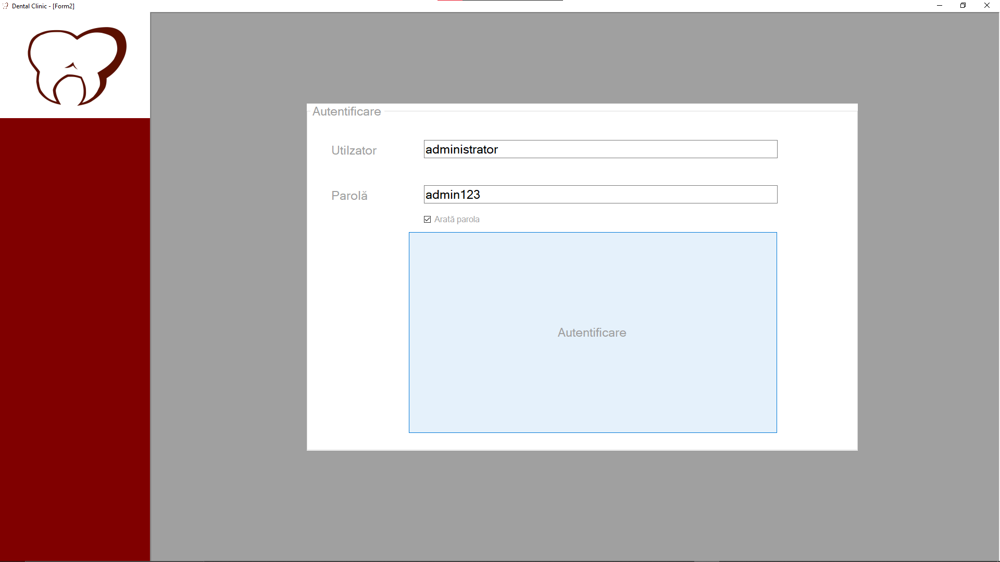
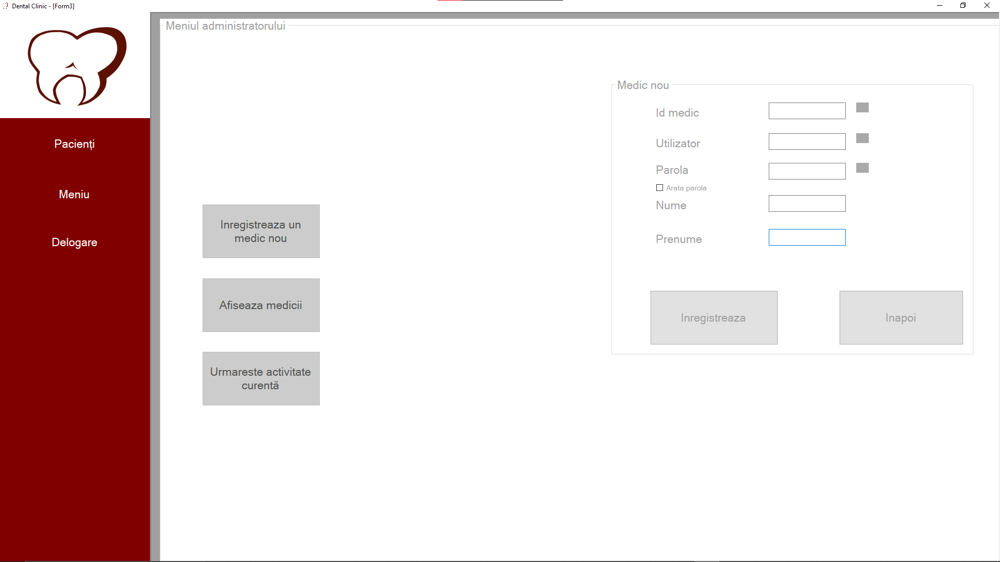
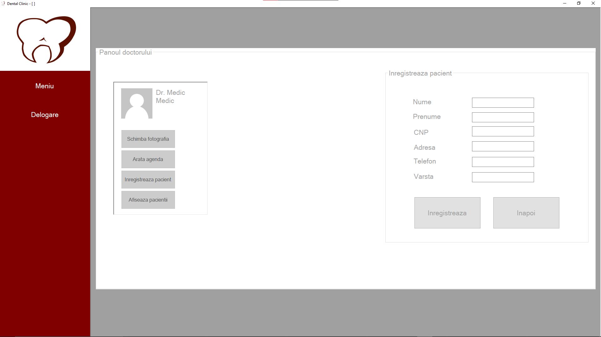
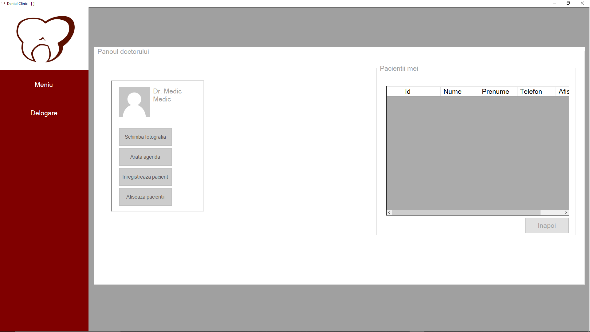
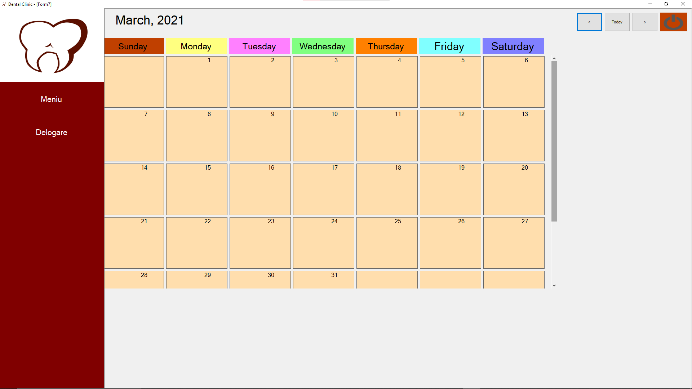

# Dentist-App

A simple application written in C# and using SQL Data bases.
This app was developed during my final year of high school. Its purpose is to help a dental clinic, or even a single doctor to schedule their/his pacients.

There is also an "administrator account" that can be accesed using the username "administrator" and the password "admin123"(the account is not stored in the databases, it's hardcoded... I know it's bad).

Warning! The app won't work on your computer because all the connectionstrings point to my local database. If you want to run the app you have to change all the connectionstrings in the program. I am sorry for the bad looking code, but in high school I didn't pay attention to how to write clean code.

# Interface

There is also a timetable where the doctor can schedule his pacients.

